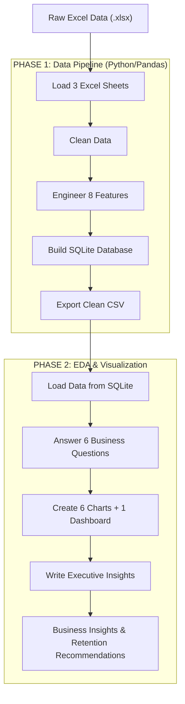

# 📺 OTT-Subscriber-Churn-Analysis

### Identifying High-Risk Subscribers & Building Retention Strategies


---

## 📌 Project Overview


In the hyper-competitive OTT streaming industry (Netflix, Hotstar, Amazon Prime),
**subscriber retention is the #1 business priority.**
Acquiring a new customer costs **5-7x more** than retaining an existing one,
yet most platforms struggle to identify *who* is about to leave — and *why*.

This project simulates a **real-world Data Analyst role** at an OTT company.
Using a multi-dimensional subscriber dataset (demographics, subscription behavior,
and support interactions), I built a complete **end-to-end data analytics pipeline**
that identifies high-risk churn segments and delivers actionable retention strategies.

 > 💼 **This project is directly applicable to:** OTT · SaaS · Fintech · Telecom · E-Commerce · AdTech

## Library Requirements

- Pandas
- NumPy
- SQLite
- Matplotlib
- Seaborn

---

## 🎯 Business Questions Answered

| # | Business Question | Finding |
|---|---|---|
| 1 | What is the overall churn rate? | **28.6%** — 4x above industry benchmark |
| 2 | Which plan type churns most? | **Basic Plan** — highest churn rate |
| 3 | Does contract type affect churn? | **Monthly contracts** churn significantly more than Annual |
| 4 | Do complaints predict churn? | **Yes — very strongly correlated** |
| 5 | Which age group is at risk? | **Age 41-50** — highest risk group |
| 6 | Why do customers leave? | **Competitor switch, Price, Content gaps** |


---

## 📊 Key Metrics & Findings

| Metric | Value |
|--------|-------|
| Total Customers | 21 |
| Overall Churn Rate | 28.6% (Benchmark: 5-7%) |
| Churned Customers | 6 |
| Active Customers | 15 |
| Monthly Revenue Lost | ₹73.94 |
| Avg Customer Tenure | 56.3 months |
| Highest Risk Segment | Basic Plan + Monthly Contract |

### 🔴 Top Risk Segments
- **Basic Plan** customers → Highest churn rate
- **Monthly contract** customers → Very high churn
- **Age 41-50** group → High risk group
- **Customers who complained** → Alarming churn rate


### 📉 Why Customers Left
| Reason | Share |
|---|---|
| Switched to Competitor | 33.3% |
| Too Expensive | 16.7% |
| Not Enough Content | 16.7% |
| Poor Streaming Quality | 16.7% |
| Forgot to Cancel Trial | 16.7% |

---

## 📈 Key Visualizations

### Overall Churn Rate


### Plan Type Analysis


### Support Complaints & Churn Score


### Age Group vs Churn


### Cancellation Reason


### Executive Dashboard


---

## 📂 Project Structure

```text
OTT-Subscriber-Churn-Analysis/
│
├── 📁 01_Data/
│   ├── 📄 customer_churn_data_raw.xlsx
│   ├── 📄 master_churn_data.csv
│   └── 📄 problem_statement.docx
│
├── 📁 02_Database/
│   ├── 🗄️ customer_churn.db
│   └── 🗄️ customer_churn_clean.db
│
├── 📁 03_Notebook/
│   ├── 📓 phase1_data_pipeline_ETL.ipynb
│   └── 📓 phase2_eda_visualization.ipynb
│
├── 📁 04_Output/
│   ├── 📊 all_charts.png
│   ├── 📊 dashboard.png
│
└── 📄 README.md
```


---


## 🔄 Project Workflow



---
## ⚙️ Feature Engineering

8 new business-relevant features were created from raw data:
| Feature | Source | Business Use |
|---|---|---|
| `age` | Calculated from `dob` | Age-based churn segmentation |
| `churn_flag` | From `cancellation_date` | **Target variable** (1=Churned, 0=Active) |
| `tenure_months` | From `subscription_start_date` | Loyalty measurement |
| `revenue_lost` | `churn_flag × monthly_charges` | Revenue impact KPI |
| `total_complaints` | Aggregated from support table | Support behavior signal |
| `has_escalation` | Max of escalations per customer | Escalation risk signal |
| `avg_csat` | Mean CSAT per customer | Satisfaction score |
| `has_complaint` | Binary from `total_complaints` | Quick churn risk flag |

---

## 🛠️ Tech Stack

| Tool | Version | Purpose |
|---|---|---|
| Python | 3.x | Core programming language |
| Pandas | 2.x | Data manipulation & cleaning |
| NumPy | Latest | Numerical computing |
| SQLite3 | Built-in | Database management & SQL queries |
| Matplotlib | Latest | Chart creation & visualization |
| Seaborn | Latest | Statistical visualizations |
| Jupyter Notebook | Latest | Development environment |


---

## 💡 Business Recommendations

| # | Recommendation | Priority | Target |
|---|---|---|---|
| 01 | Convert Monthly → Annual subscribers (offer 2 months free) | 🔴 HIGH | Retention Team |
| 02 | Basic Plan retention campaign (trial premium upgrade) | 🔴 HIGH | Product Team |
| 03 | Complaint early warning system (CSAT < 3 → auto escalate) | 🚨 CRITICAL | Support Team |
| 04 | Age 41-50 targeted content strategy (family + regional) | 🟡 MEDIUM | Content Team |
| 05 | Loyalty discount program (15-20% after 12 months) | 🟡 MEDIUM | Pricing Team |

---

## 🚀 How to Run This Project

### Prerequisites
```bash
pip install pandas numpy matplotlib seaborn openpyxl jupyter
```

### Steps
```bash
# Step 1: Clone the repository
git clone https://github.com/girishpathakk/OTT-Subscriber-Churn-Analysis.git
# Step 2: Navigate to project folder
cd ott-subscriber-churn-analysis

# Step 3: Run Phase 1 - Data Pipeline
jupyter notebook 03_Notebooks/phase1_data_pipeline.ipynb

# Step 4: Run Phase 2 - EDA & Visualization
jupyter notebook 03_Notebooks/phase2_eda_visualization.ipynb
```

> **Note:** Run Phase 1 first — it creates the SQLite database that Phase 2 reads from.

---

## 🎓 Skills Demonstrated

- ✅ End-to-end data pipeline: Excel → Python → SQLite → Insights
- ✅ Multi-table relational data management & SQL joins
- ✅ Data cleaning: null handling, encoding, typo fixing, standardization
- ✅ Advanced feature engineering (8 business features)
- ✅ Exploratory Data Analysis — 6 business questions answered
- ✅ Professional data visualization with business context
- ✅ Executive-level reporting & storytelling
- ✅ Translating technical findings into actionable business strategies

---
## 👤 Author

**Girish Pathak**

[](https://linkedin.com/in/girishpathakk)
[](https://github.com/girishpathakk)
[](mailto:girish.pathak.ds@gmail.com)

---


<div align="left">

**⭐ If you found this project useful, please give it a star!**

*This project demonstrates real-world Data Analyst skills applicable to*  
*OTT · SaaS · Fintech · Telecom · E-Commerce · AdTech industries*

</div>
